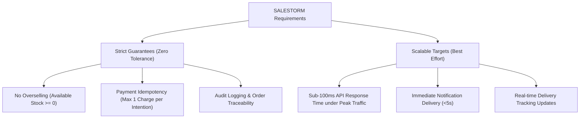

# SALESTORM — Stage 1: Requirements & System Assumptions

## 1. Executive Summary & Problem Context
**SALESTORM** is a high-scale e-commerce platform preparing for a limited-stock flash sale campaign. In this scenario, **Product X** has only **100 units available**, while a sudden surge of **10,000 concurrent customers** click "Buy Now" at the exact same instant. 

Management requires a system design and implementation architecture that:
1. Prevents inventory overselling under high concurrency (exactly $\le 100$ successful sales).
2. Manages temporary inventory reservations with strict expiration and automatic release.
3. Guarantees idempotent payment processing and safe handling of gateway timeouts or failures.
4. Maintains an audit-traceable order lifecycle (`CREATED` $\rightarrow$ `PAYMENT_PENDING` $\rightarrow$ `CONFIRMED` $\rightarrow$ `PROCESSING` $\rightarrow$ `SHIPPED` $\rightarrow$ `DELIVERED`).
5. Recovers gracefully from service, database, and payment gateway downtime without data corruption.

---

## 2. Business Objectives & Critical Requirements

| Objective | Business Goal | Technical Requirement |
| :--- | :--- | :--- |
| **Oversell Protection** | Maximize sales without selling non-existent stock | Strict atomic decrement / lock mechanism. Zero negative inventory. |
| **Traffic Resilience** | Survive 100x-500x traffic spikes | Rate limiting, token bucket throttling, queue-based load shedding. |
| **Reservation Expiry** | Reclaim locked units from abandoned carts | 15-minute reservation TTL with background cleanup / queue delay release. |
| **Payment Safety** | Prevent double charging | Unique `idempotency_key` per transaction & distributed locks. |
| **Order Consistency** | Eventual consistency for downstream order fulfilment | Saga pattern with compensation transactions. |

---

## 3. Measurable Non-Functional Requirements (NFRs)

### 3.1 Throughput & Latency Requirements
- **Peak Purchase Throughput**: Minimum **10,000 requests/second** during flash sale start.
- **Reservation API Latency**: $P_{99} < 100\text{ms}$, $P_{95} < 50\text{ms}$.
- **Checkout/Payment Latency**: $P_{99} < 1.5\text{s}$ (including external payment gateway handshake).
- **Read Operations (Product/Stock Check)**: $P_{99} < 20\text{ms}$ via CDN & Distributed Caching (Redis).

### 3.2 Reliability & Availability
- **System Availability Target**: $99.99\%$ ($4$ nines) during active flash sale windows.
- **Data Durability**: Zero lost confirmed orders ($RPO = 0$, $RTO < 5\text{s}$ for failover).
- **Fault Tolerance**: Upstream services must fail fast when downstream dependencies (e.g. payment provider) fail.

### 3.3 Security & Compliance
- **Authentication**: JWT-based OAuth2 / Bearer Tokens for customer APIs.
- **Abuse Prevention**: IP-based & User-ID-based Rate Limiting (Token Bucket: max 5 requests/sec per user).
- **PCI-DSS Compliance**: Direct tokenized payment card handling via external payment providers (Stripe/PayPal Adapter).

---

## 4. Key Assumptions & Constraints

1. **Flash Sale Characteristics**:
   - High read-to-write ratio for product page browsing ($100:1$).
   - Extreme write contention on a single DB row/entity (Inventory for Product X).
2. **Inventory Constraints**:
   - Total available initial quantity: **100 units**.
   - Maximum purchase limit: **1 unit per customer**.
3. **Traffic Distribution**:
   - Concurrent incoming users: **10,000 active sessions**.
   - Expected payment success rate: **95%**, payment gateway failure rate: **5%**.
   - Duplicate request rate (network retransmissions / double clicks): **2%**.
   - Temporary downstream Order Service outage window: **30 seconds**.

---

## 5. Requirement Categorization: Strict Guarantees vs. Scalable Targets

- **Strict Guarantees**:
  - Inventory availability can never drop below `0`.
  - A customer card is charged at most once per checkout session.
  - Expired reservations MUST return stock to available pool.
- **Scalable Targets**:
  - API response time during peak 10,000 req/sec surge (traffic shedding is acceptable over crashing).
  - Asynchronous notification delivery (SMS/Email) delays up to 60 seconds are acceptable.
