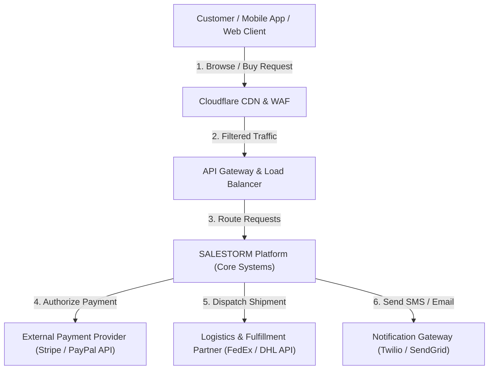
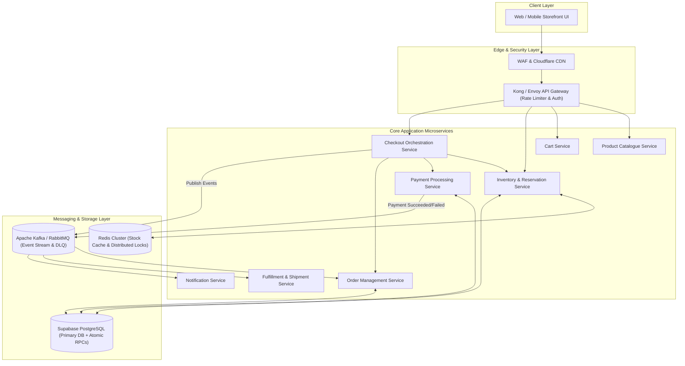
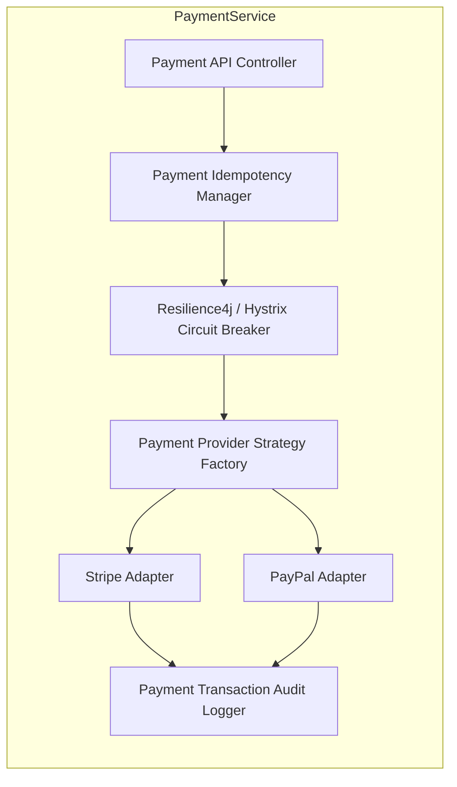

# SALESTORM — Stage 2: High-Level System Architecture (HLD)

## 1. System Context Diagram (C4 Level 1)

The System Context Diagram shows how customers interact with the SALESTORM platform and external 3rd-party services (Payment Gateway, Logistics Partner, Notification Providers).



---

## 2. Container / Service Architecture (C4 Level 2)



---

## 3. Component Diagram for Critical Services (C4 Level 3)

### 3.1 Inventory & Reservation Service Internal Components


### 3.2 Payment Processing Service Internal Components


---

## 4. Deployment Diagram (Kubernetes Multi-AZ Infrastructure)

```mermaid
graph TD
    subgraph AWS Cloud Region (us-east-1)
        subgraph Availability Zone A
            IngressA["Ingress Controller Pod"]
            InventoryPodA["Inventory Service Pod"]
            PaymentPodA["Payment Service Pod"]
            OrderPodA["Order Service Pod"]
            RedisMaster["Redis Primary Node"]
        end

        subgraph Availability Zone B
            IngressB["Ingress Controller Pod"]
            InventoryPodB["Inventory Service Pod"]
            PaymentPodB["Payment Service Pod"]
            OrderPodB["Order Service Pod"]
            RedisReplica["Redis Replica Node"]
        end

        subgraph Managed DB Layer (Supabase / AWS RDS)
            PostgresPrimary[("PostgreSQL Primary (Read/Write)")]
            PostgresReplica[("PostgreSQL Read Replica")]
        end
    end

    IngressA --> InventoryPodA
    IngressB --> InventoryPodB
    InventoryPodA --> RedisMaster
    InventoryPodB --> RedisReplica
    InventoryPodA --> PostgresPrimary
    InventoryPodB --> PostgresReplica
    PostgresPrimary -.->|Async Replication| PostgresReplica
```

---

## 5. Synchronous vs. Asynchronous Communication Matrix

| Interaction | Mode | Protocol | Rationale |
| :--- | :--- | :--- | :--- |
| **User $\rightarrow$ Inventory Reservation** | Synchronous | REST / gRPC | User requires instant feedback on whether unit is reserved ($<100\text{ms}$). |
| **Checkout $\rightarrow$ Payment Processing** | Synchronous | REST / HTTPS | Real-time payment card validation & authorization requirement. |
| **Payment Success $\rightarrow$ Order Creation** | Asynchronous | Kafka Event (`payment.succeeded`) | Decouples Payment Service from potential Order Service outages (e.g. 30s crash recovery). |
| **Order Confirmed $\rightarrow$ Fulfillment** | Asynchronous | RabbitMQ Queue | Warehouse picking and packaging operation is non-blocking. |
| **Order Lifecycle $\rightarrow$ Notifications** | Asynchronous | Kafka / EventBridge | Email/SMS notifications should never block core transactional workflows. |

---

## 6. Bottleneck Identification & Infrastructure Justification

1. **DB Row Contention on Single Flash Sale Item**:
   - *Problem*: 10,000 threads trying to `UPDATE inventory SET available_quantity = available_quantity - 1 WHERE product_id = X` creates massive DB transaction lock wait timeouts.
   - *Mitigation*: Redis Lua script atomic pre-reservation + PostgreSQL stored procedure using `SELECT ... FOR UPDATE SKIP LOCKED` or optimistic versioning.
2. **Payment Gateway Latency & Failures**:
   - *Problem*: External payment APIs take 1-3 seconds to respond and may fail or timeout.
   - *Mitigation*: Circuit Breaker pattern (isolates failing gateway) + Async Reconciliation Worker + Idempotency Tokens.
3. **Thundering Herd Problem at Sale Launch**:
   - *Problem*: Exact 09:00 AM traffic burst.
   - *Mitigation*: Cloudflare WAF Queue-it virtual waiting room + Token Bucket rate limiting at API Gateway.
