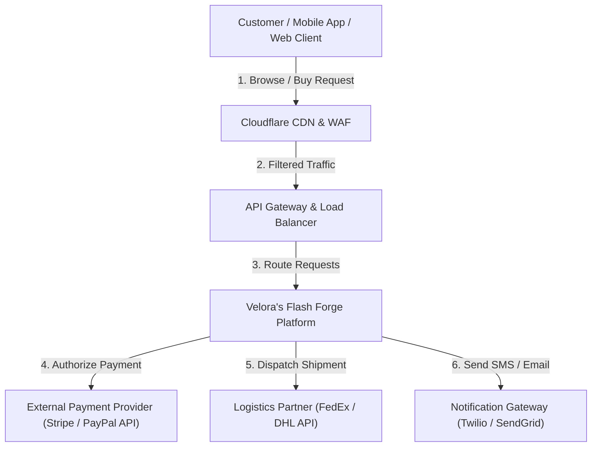
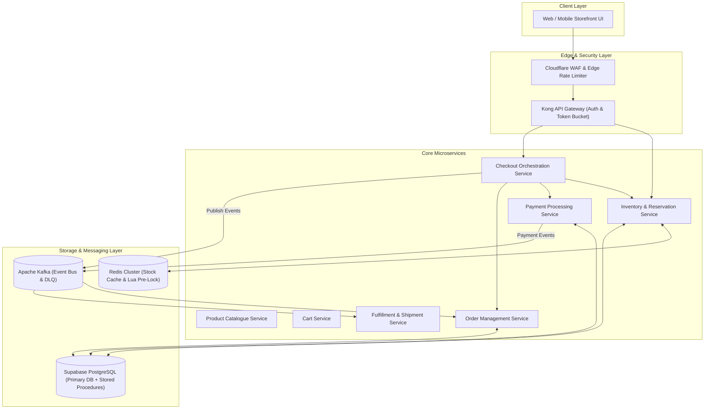
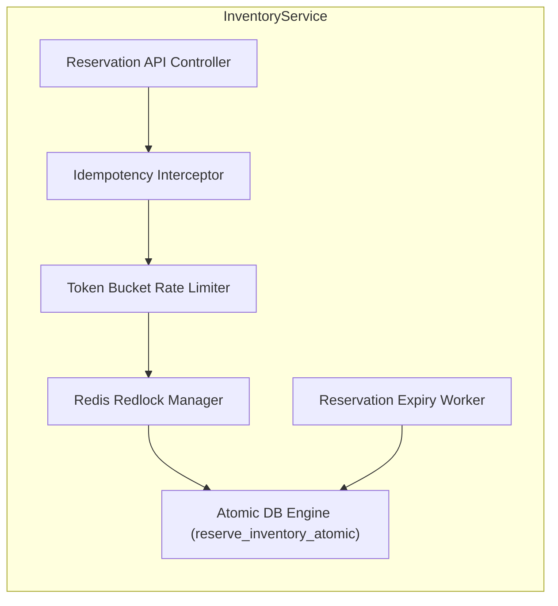

# Velora's Flash Forge — Stage 2: High-Level System Architecture (HLD)

> **Project Name**: Velora's Flash Forge  
> **Hackathon**: SALESTORM System Design Challenge 2026

---

## 1. System Context Diagram (C4 Level 1)

The System Context Diagram shows how customers interact with **Velora's Flash Forge** and external 3rd-party services (Stripe Payment Gateway, FedEx Logistics, Twilio Notifications).

---

## 2. Container / Service Architecture (C4 Level 2)

---

## 3. Component Diagram for Critical Services (C4 Level 3)

### 3.1 Inventory & Reservation Service Internal Components

---

## 4. Deployment Diagram (AWS Kubernetes Infrastructure)

---

## 5. High-Performance Tech Stack Rationale for Judges

1. **Why Cloudflare WAF + Kong API Gateway?**  
   Drops DDoS attacks and enforces rate limits at global edge locations before traffic hits backend application servers.
2. **Why Redis Cluster with Atomic Lua Scripts?**  
   Pre-checks stock in RAM ($<1\text{ms}$). Deducts stock for 100 winners and polite-rejects 9,900 losers without causing DB transaction lock contention.
3. **Why Supabase PostgreSQL + PgBouncer?**  
   ACID compliance guaranteed via engine-level row locks (`SELECT FOR UPDATE`) and `reserve_inventory_atomic` stored procedure. PgBouncer handles connection pooling under 10k surges.
4. **Why Apache Kafka for Event Bus?**  
   Sustains $>1\text{M}$ msg/sec throughput. Buffers order creation events safely during 30-second downstream Order Service outages.
