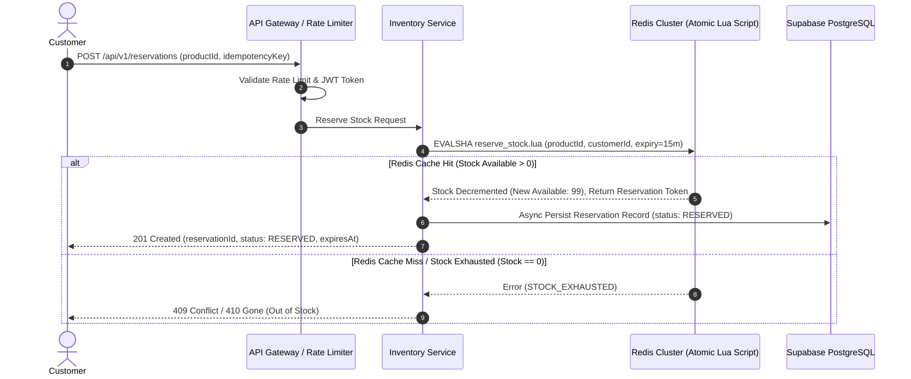
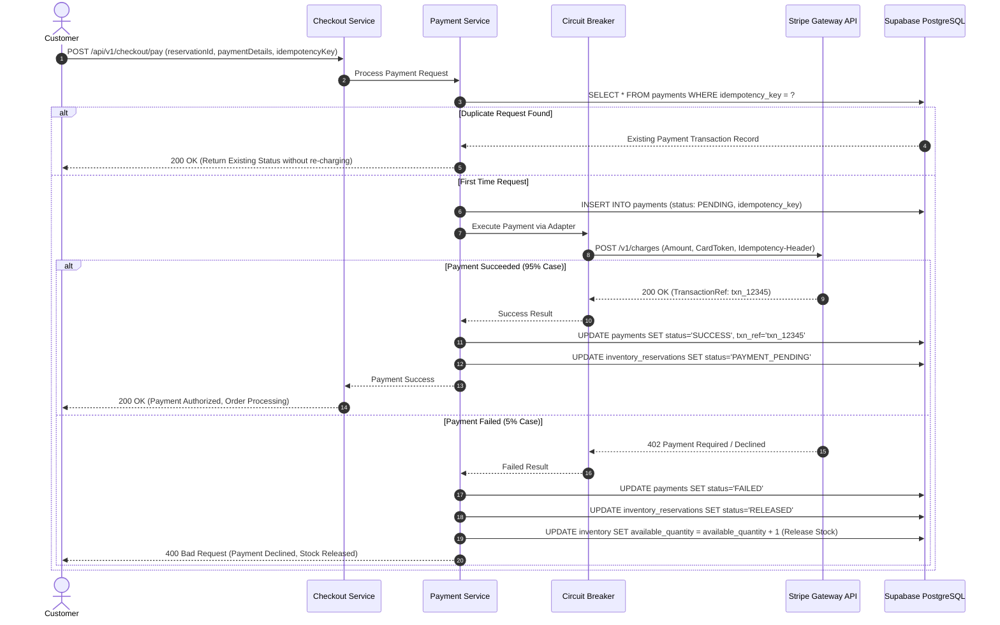
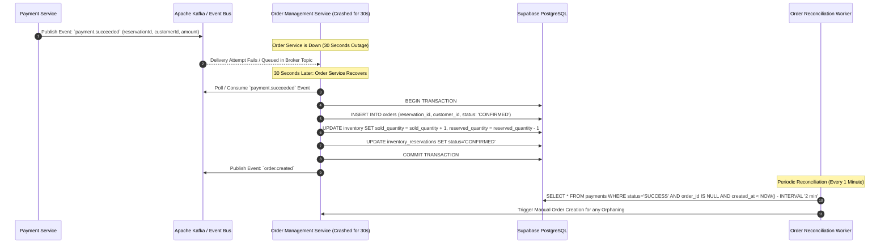
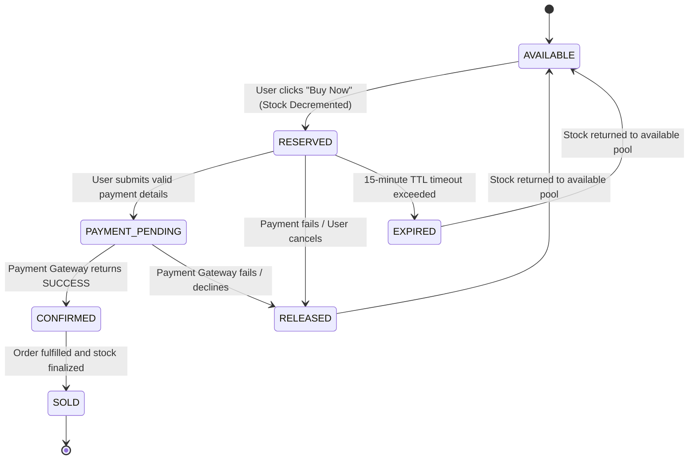
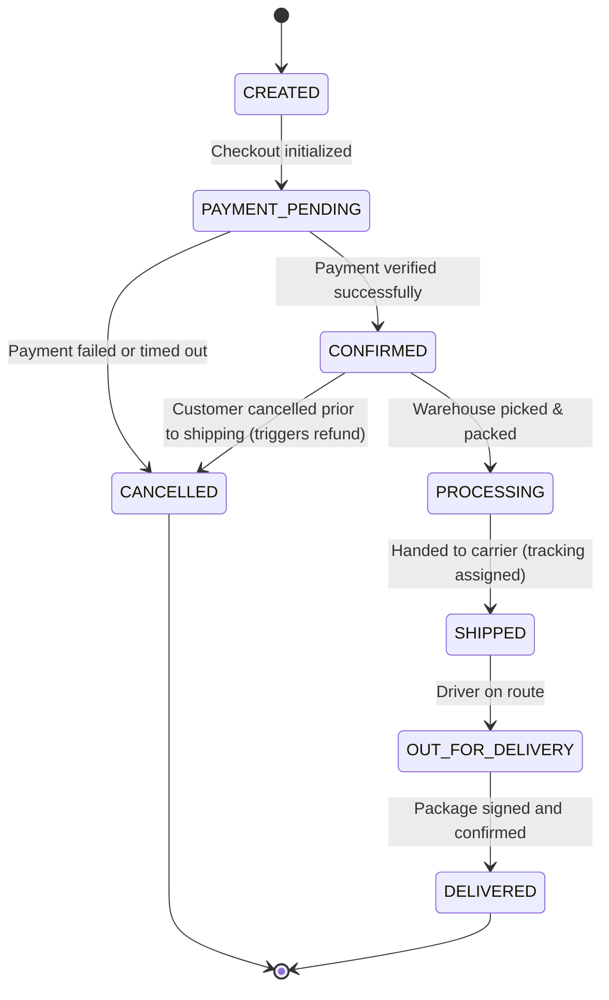

# SALESTORM — Stage 3: Low-Level Design (LLD) & Sequence Diagrams

## 1. Object-Oriented Class Diagram (Core Domain Modules)

```mermaid
classDiagram
    class Inventory {
        +UUID inventoryId
        +UUID productId
        +int availableQuantity
        +int reservedQuantity
        +int soldQuantity
        +long version
        +reserveUnits(quantity: int) Reservation
        +releaseUnits(quantity: int) void
        +confirmSale(quantity: int) void
    }

    class InventoryReservation {
        +UUID reservationId
        +UUID inventoryId
        +UUID customerId
        +int quantity
        +ReservationStatus status
        +DateTime expiresAt
        +String idempotencyKey
        +isExpired() boolean
        +markPaid() void
        +markExpired() void
    }

    class ReservationStatus {
        <<enumeration>>
        RESERVED
        PAYMENT_PENDING
        CONFIRMED
        RELEASED
        EXPIRED
    }

    class Order {
        +UUID orderId
        +UUID customerId
        +UUID reservationId
        +Money totalAmount
        +OrderStatus status
        +String idempotencyKey
        +transitionTo(nextStatus: OrderStatus) void
        +cancelOrder(reason: String) void
    }

    class OrderStatus {
        <<enumeration>>
        CREATED
        PAYMENT_PENDING
        CONFIRMED
        PROCESSING
        SHIPPED
        OUT_FOR_DELIVERY
        DELIVERED
        CANCELLED
    }

    class PaymentTransaction {
        +UUID paymentId
        +UUID orderId
        +UUID reservationId
        +Money amount
        +PaymentStatus status
        +String transactionRef
        +String idempotencyKey
        +markSuccess(ref: String) void
        +markFailed(reason: String) void
    }

    class PaymentStatus {
        <<enumeration>>
        PENDING
        SUCCESS
        FAILED
        TIMED_OUT
        REFUNDED
    }

    interface IPaymentGatewayAdapter {
        +processPayment(request: PaymentRequest) PaymentResult
        +queryTransaction(transactionRef: String) PaymentResult
    }

    class StripePaymentAdapter {
        +processPayment(request: PaymentRequest) PaymentResult
    }

    class PayPalPaymentAdapter {
        +processPayment(request: PaymentRequest) PaymentResult
    }

    Inventory "1" -- "0..*" InventoryReservation : tracks
    InventoryReservation "1" -- "0..1" Order : results in
    Order "1" -- "1" PaymentTransaction : associated with
    IPaymentGatewayAdapter <|.. StripePaymentAdapter
    IPaymentGatewayAdapter <|.. PayPalPaymentAdapter
```

---

## 2. Sequence Diagram 1: Flash Sale Purchase & Reservation Flow



---

## 3. Sequence Diagram 2: Payment Processing & Safe Idempotency Flow



---

## 4. Sequence Diagram 3: Asynchronous Order Creation & Downstream Outage Recovery (30s Outage Scenario)



---

## 5. State Diagrams

### 5.1 Reservation Lifecycle State Diagram


### 5.2 Order Lifecycle State Diagram

