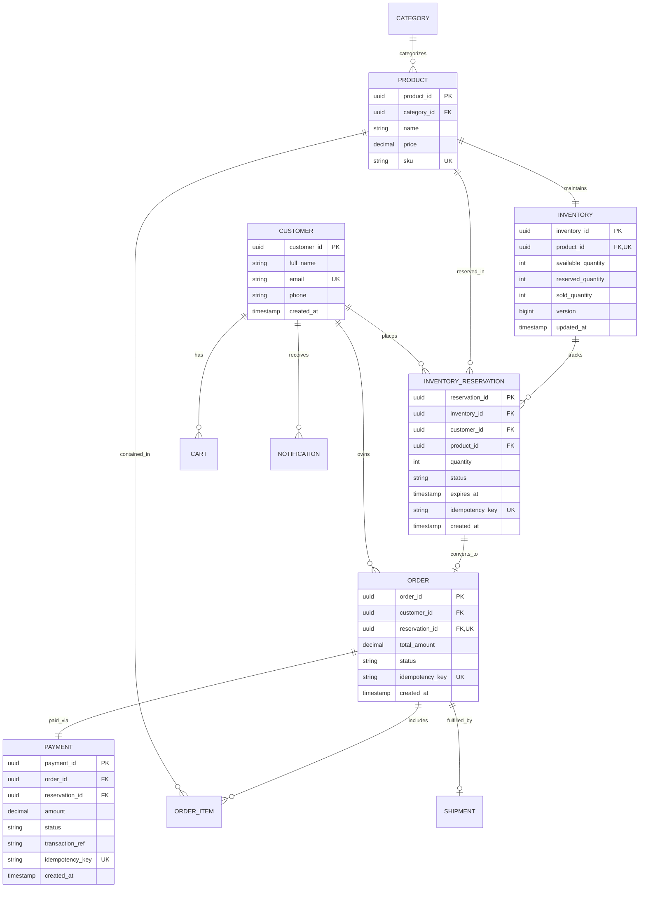

# SALESTORM — Stage 4: Data & Database Design

## 1. Relational Entity-Relationship (ER) Diagram



---

## 2. Database Design & Concurrency Strategy

### 2.1 Primary Keys & Foreign Keys
- All primary keys use `UUID` (v4) to prevent enumeration attacks and support distributed database sharding without ID collision.
- Foreign keys maintain referential integrity with strict indexing for JOIN performance.

### 2.2 Indexing Strategy for High Concurrency
1. `inventory_reservations (idempotency_key)`: Unique B-tree index to guarantee instant duplicate check.
2. `inventory_reservations (expires_at, status)`: Partial index for fast background worker querying of expired reservations (`WHERE status = 'RESERVED' AND expires_at < NOW()`).
3. `payments (idempotency_key)`: Unique B-tree index to enforce payment idempotency.
4. `inventory (product_id)`: Covered index for stock lookup.

### 2.3 Transaction Boundaries & Concurrency Control
- **Optimistic Concurrency Control (OCC)**: Using the `version` column in `INVENTORY` table:
  ```sql
  UPDATE inventory 
  SET available_quantity = available_quantity - 1, 
      reserved_quantity = reserved_quantity + 1,
      version = version + 1
  WHERE product_id = '...' 
    AND available_quantity >= 1 
    AND version = :current_version;
  ```
- **Pessimistic Row Locking (`FOR UPDATE SKIP LOCKED`)**:
  When processing queue batches, worker threads grab available stock without blocking other threads:
  ```sql
  SELECT * FROM inventory WHERE product_id = '...' FOR UPDATE;
  ```
- **Supabase Atomic RPC Procedure (`reserve_inventory_atomic`)**:
  Protects against race conditions by wrapping check + lock + reservation creation inside a single ACID PostgreSQL transaction block.
