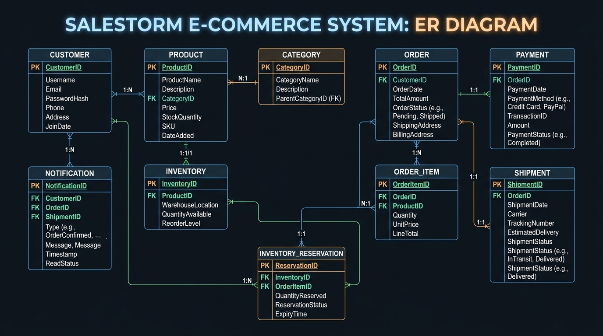
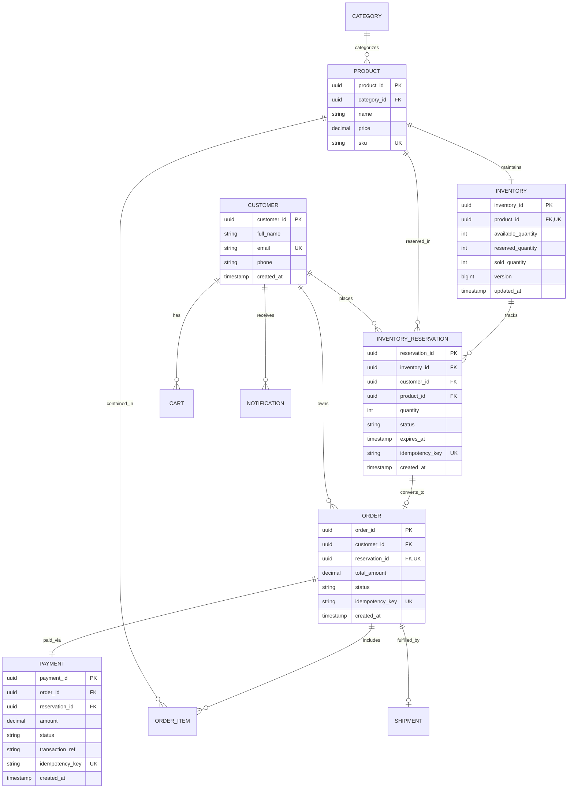

# Velora's Flash Forge — Stage 4: Data & Database Design

> **Project Name**: Velora's Flash Forge  
> **Hackathon**: SALESTORM System Design Challenge 2026

---

## 1. Relational Entity-Relationship (ER) Diagram

---

## 2. Supabase PostgreSQL Choice & Concurrency Defense

### Why Supabase PostgreSQL over MongoDB / NoSQL?
1. **Engine-Level Row Locking (`SELECT FOR UPDATE`)**: Guarantees that even under 10,000 concurrent updates on Product X, PostgreSQL serializes requests at the row level.
2. **Atomic Stored Procedure (`reserve_inventory_atomic`)**: Combines availability check, stock decrement, version increment, and reservation insertion into a single ACID transaction block.
3. **Database Constraints (`CHECK available_quantity >= 0`)**: Prevents negative stock at the engine layer regardless of application bugs.
4. **PgBouncer Connection Pooling**: Prevents database thread starvation during 10k request traffic surges.
