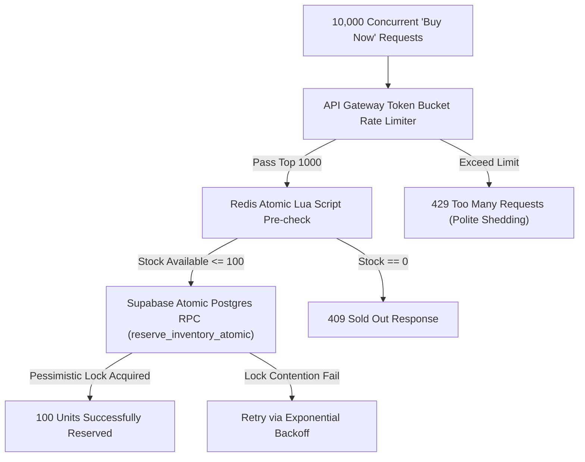
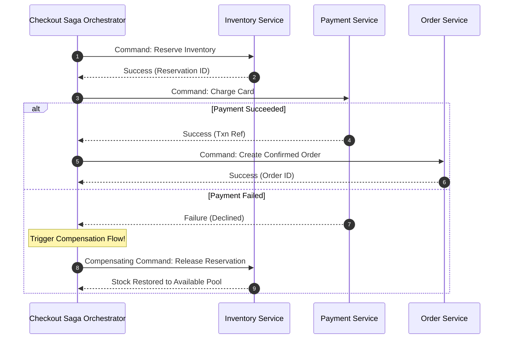

# SALESTORM — Stage 8: Scalability, Reliability & Fault-Tolerance Design

## 1. Concurrency Control Strategy Matrix

### Optimistic vs. Pessimistic Locking Comparison

| Feature | Optimistic Concurrency Control (OCC) | Pessimistic Locking (`SELECT FOR UPDATE`) | Selected Approach for SALESTORM |
| :--- | :--- | :--- | :--- |
| **Mechanics** | Version column check (`version = v+1`) | DB Row lock held during transaction | **Hybrid Strategy**: Redis Lua pre-reservation + Atomic DB Stored Procedure |
| **High Contention Performance** | Poor (99% retries under 10k users on 1 row) | Excellent (serializes access deterministically) | Highly scalable (Redis filters out 9,900 requests in RAM; DB executes 100 locks) |
| **Overhead** | Low lock overhead, high CPU burn on retries | Higher DB lock hold time | Optimal balance of throughput and data safety |

---

## 2. Distributed Transaction Management (SAGA Pattern)

Because microservices maintain isolated database tables, SALESTORM implements an **Orchestrated Saga** for distributed order fulfillment:

---

## 3. Resilience Strategies: Retry, Circuit Breaker & DLQ

### 3.1 Retry Policy with Exponential Backoff and Jitter
When communicating across microservices, transient network glitches are retried using formula:
$$t_{\text{wait}} = \min(t_{\text{max}}, t_{\text{base}} \times 2^{\text{attempt}}) + \text{random\_jitter}(0, 100\text{ms})$$

### 3.2 Dead Letter Queue (DLQ) Management
Events that fail processing after $3$ retry attempts are automatically pushed to `salestorm.dlq.orders` topic for manual ops inspection and automated reconciliation scripts.

---

## 4. Practical Test Case Scenario Defense (10,000 Users / 100 Units)

| Test Metric | Specified Scenario | SALESTORM Architectural Safeguard |
| :--- | :--- | :--- |
| **Concurrent Traffic** | 10,000 requests at 09:00:00 AM | Redis atomic Lua script handles $10,000$ RPS in $<5\text{ms}$. Only 100 claim reservations; 9,900 receive clean "Sold Out" responses. |
| **Payment Success** | 95% success rate | 95 reservations convert to `CONFIRMED` orders. |
| **Payment Failure** | 5% failure rate | 5 failed payments trigger compensation workflow, unlocking 5 units back to available pool for next waiting customers. |
| **Duplicate Requests** | 2% duplicate network requests | Idempotency middleware matches `X-Idempotency-Key` in DB index, returning original response without double reservations or double charges. |
| **Order Service Outage** | Order service down for 30s | Payment service emits `payment.succeeded` event to Kafka broker. Events wait in topic partition until Order service reboots and resumes consumption. Zero lost orders! |
