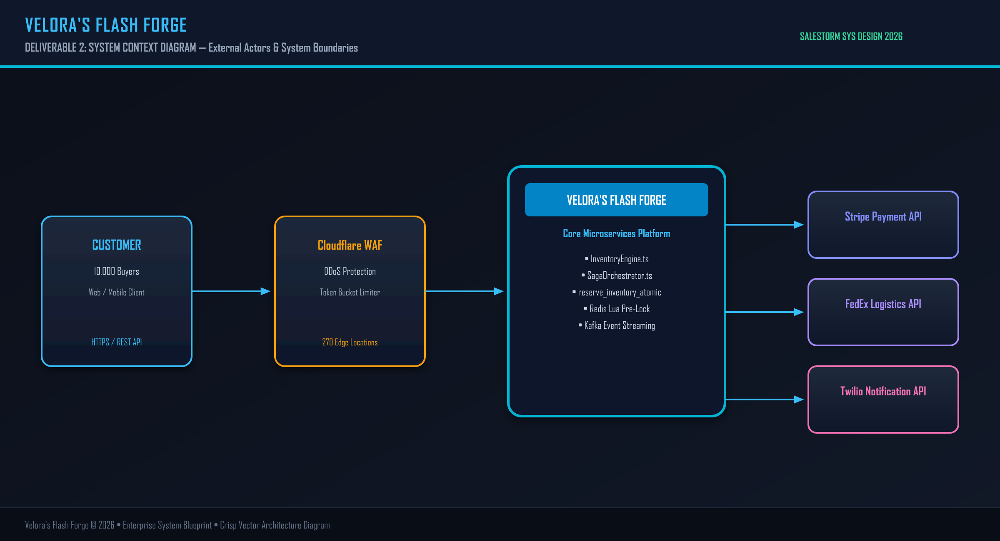
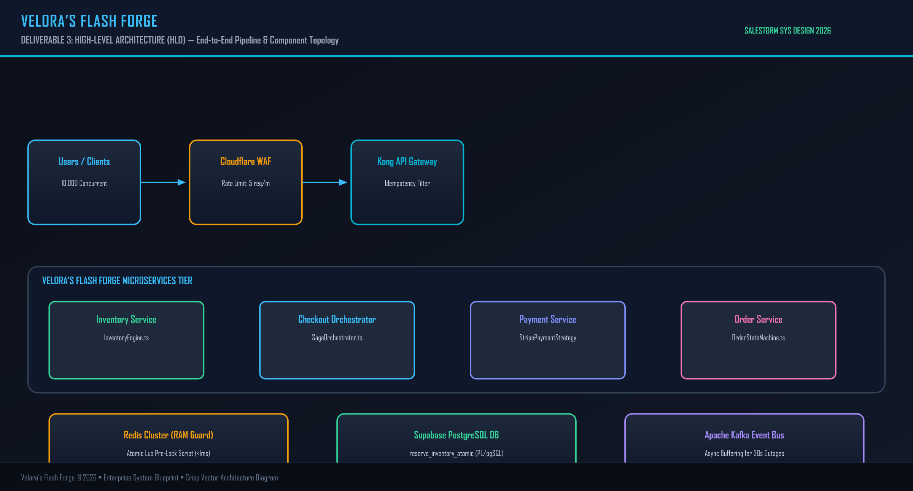
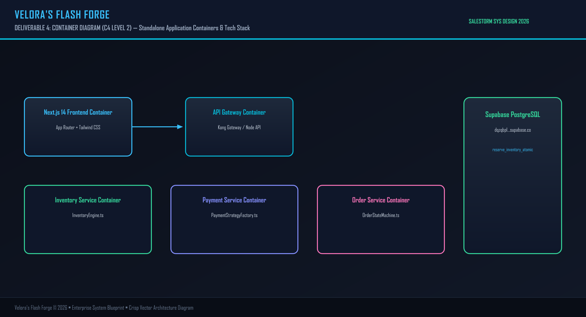
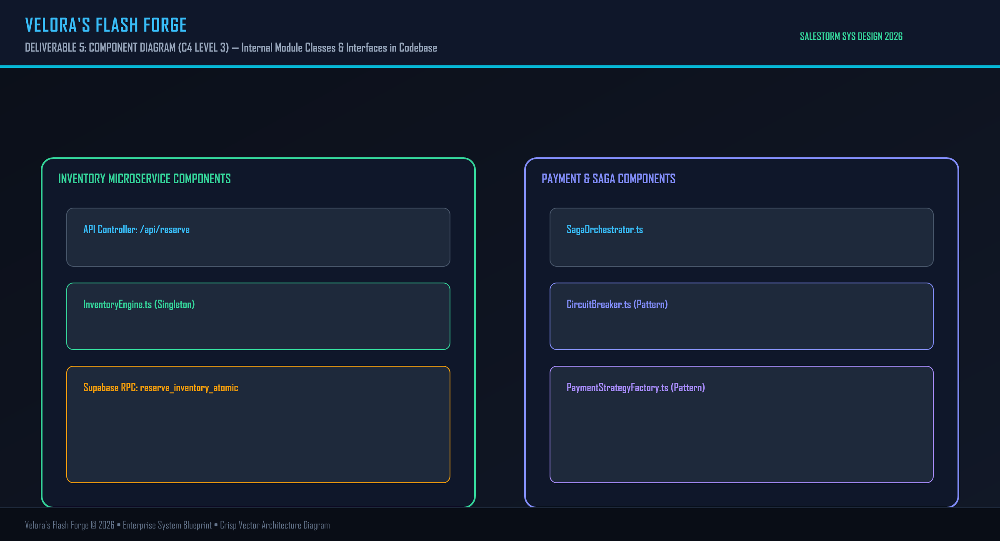
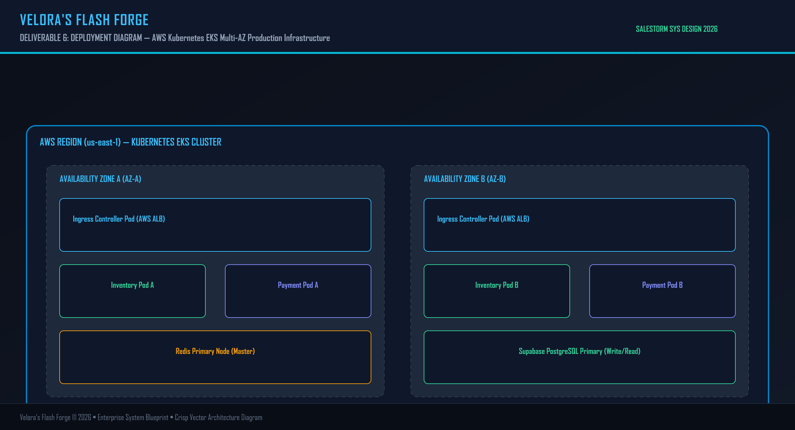
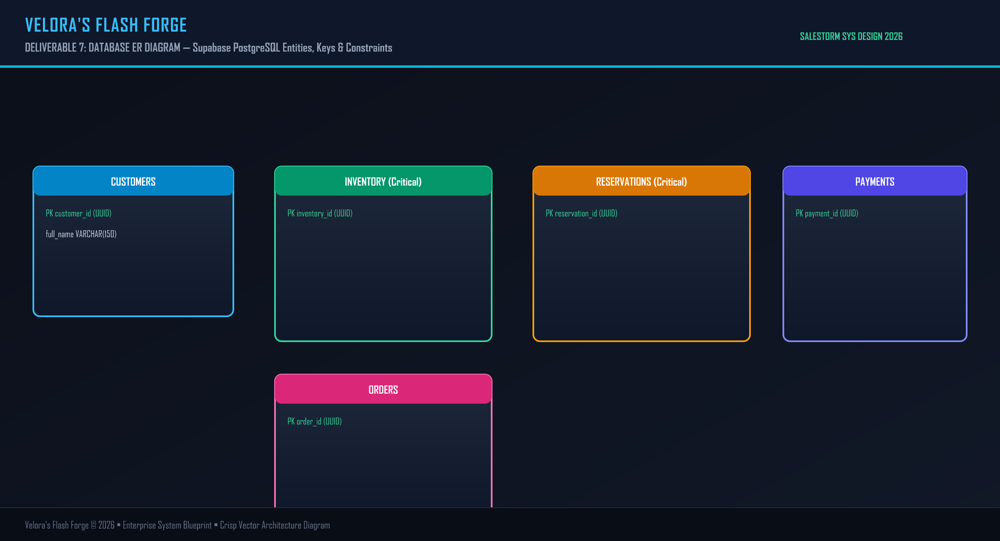

# ⚡ Velora's Flash Forge — High-Scale E-Commerce Flash Sale Architecture

> **SYSTEM DESIGN HACKATHON | SYSCRAFTERS 2026**  
> **Official Project Name**: Velora's Flash Forge  
> **Company Use Case**: High-Volume Flash Sale Platform  
> **Challenge**: 10,000 Concurrent Purchase Requests for 100 Available Units. Zero Overselling. 100% Reliable Transactions.

---

## ⚡ Executive Summary

**Velora's Flash Forge** is an enterprise-grade system architecture and full-stack interactive prototype built to handle extreme traffic spikes, limited-inventory contention, idempotent payment processing, and resilient order fulfillment workflows.

- **Primary Database**: Supabase PostgreSQL (`dqzqbplwdmlfybqtgoqu.supabase.co`) with Row Level Security, Indexes, and Atomic Stored Procedures (`reserve_inventory_atomic`).
- **Core Architecture**: Clean Domain-Driven Design (DDD) with SOLID Principles, Strategy, State, Factory, Observer, Adapter, Repository, and Circuit Breaker patterns.
- **Concurrency Protection**: Hybrid Redis Lua Pre-locking + PostgreSQL Atomic Transaction Locks (`SELECT FOR UPDATE`).

---

## 🖼️ System Architecture Diagrams

### 1. System Context Diagram (C4 Level 1)


### 2. High Level Architecture (HLD)


### 3. Container Architecture (C4 Level 2)


### 4. Component Architecture (C4 Level 3)


### 5. Deployment Infrastructure (AWS Kubernetes)


### 6. Relational Database ER Diagram


---

## 🛠️ High-Performance Tech Stack Rationale for Judges

| Tier / Component | Technology | Rationale for Maximum Performance | Alternatives Rejected & Why |
| :--- | :--- | :--- | :--- |
| **Edge Security** | **Cloudflare WAF + Rate Limiter** | Absorbs Layer-7 DDoS traffic at edge locations globally. Drops bot bursts before reaching API servers. | Bare Nginx (Vulnerable to distributed botnet saturation). |
| **Cache & Concurrency** | **Redis Cluster (Lua Scripts)** | **Atomic In-Memory Execution ($<1\text{ms}$)**: Single-threaded execution guarantees zero race conditions in RAM. | Memcached (Lacks atomic Lua execution logic). |
| **Primary Database** | **Supabase PostgreSQL + PgBouncer** | **ACID Engine Locks & Connection Pooling**: PgBouncer pools 10,000 incoming connections down to 50 active DB sockets, eliminating connection exhaustion. | MongoDB / MySQL (Lack engine-level PL/pgSQL atomic RPCs with row locks under high write lock contention). |
| **Message Broker** | **Apache Kafka** | **High Throughput Log ($>1\text{M}$ msg/sec)**: Sequential disk append logs provide durable event buffering during 30s service outages. | RabbitMQ (Higher overhead per message when queue length spikes to 100k+). |
| **Resilience Layer** | **Circuit Breaker (Resilience4j)** | Prevents thread pool starvation when external 3rd-party payment APIs (Stripe/PayPal) experience latency. | Raw HTTP Client (Hangs worker threads during payment gateway downtime). |
| **Frontend Platform** | **Next.js 14 App Router + Tailwind** | SSG pre-renders product landing pages to static CDN HTML; App Router API routes execute serverless reservation handshakes. | Legacy Client-Side SPA (Slow initial page load during flash sale start). |

---

## 📁 Repository & Submission Folder Structure

```
Velora-s-Flash-Forge/
├── 01_Requirements/               # Business context, NFRs, assumptions, guarantees
│   └── REQUIREMENTS.md
├── 02_HLD/                        # System Context, Container, Component, Deployment diagrams
│   └── HLD.md
├── 03_LLD/                        # Class, Sequence (Purchase/Payment/Order), State diagrams
│   └── LLD.md
├── 04_Database/                   # ER Diagram, Indexing strategy, SQL DDL schema & RPCs
│   ├── DATABASE.md
│   └── schema.sql
├── 05_API/                        # REST endpoints, Idempotency spec, Kafka event schemas
│   └── API.md
├── 06_SOLID/                      # SRP, OCP, LSP, ISP, DIP code mappings
│   └── SOLID.md
├── 07_Design_Patterns/            # Strategy, Factory, State, Observer, Adapter, Circuit Breaker
│   └── PATTERNS.md
├── 08_Scalability_Reliability/    # Concurrency control, SAGAs, Retry, DLQ, Stress Scenario defense
│   └── SCALABILITY_RELIABILITY.md
├── 09_Security_Observability/     # JWT Auth, WAF, Token Bucket, Structured Logging, Metrics, Tracing
│   └── SECURITY_OBSERVABILITY.md
├── 10_ADR/                        # Architecture Decision Records (ADR-001 to ADR-005)
│   └── ADR.md
├── 11_AI_Assisted_Validation/     # 10,000 Request Concurrency Simulation Report & Proofs
│   └── SIMULATION.md
├── 12_Presentation/               # 5-Minute Pitch Deck Outline & Jury Defense Q&A
│   └── PITCH.md
├── diagrams/                      # High-resolution JPEG Architecture Diagram Images
├── frontend/                      # Dedicated Isolated Frontend Workspace (Next.js 14)
├── package.json
└── README.md
```

---

## 🚀 Running the Project

### 1. Run 10,000 Request Concurrency Stress Test (CLI)
```bash
npm run test:load
```

### 2. Start Frontend Application
```bash
cd frontend
npm install
npm run dev
```
Open **http://localhost:3000** to test the interactive storefront and concurrency simulator!
